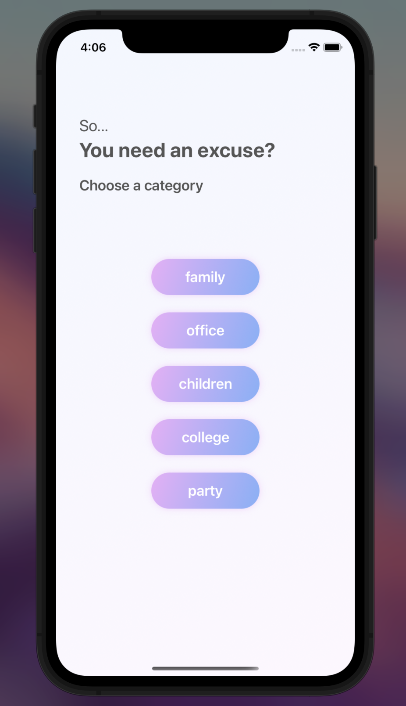
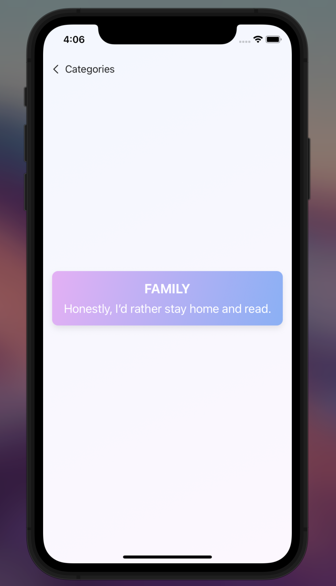
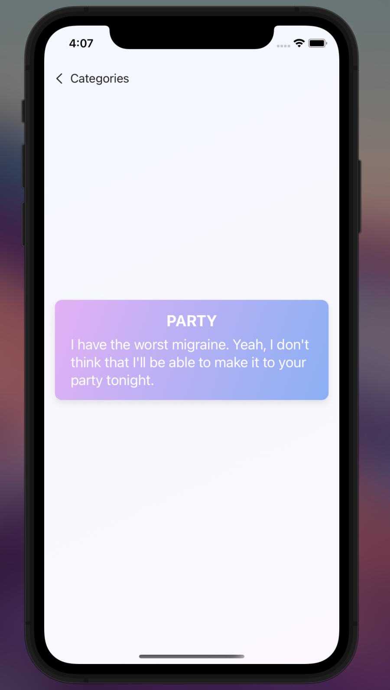

# ExcuseGenerator
A simple app that uses Excuser API service.
You can use this app to get random excuses for a specific category via **API calls**.

Note: This project was made as an effort to show how to use APIs the most simple way possible.

## Architecture
- SwiftUI and MVVM
- Customisable URL to Show an Excuse From Desired Category
- URLSession, DataTask Requests Inside ViewModel
- Custom Model Presentation
- Animations
- NavigationLinks and Dismissing Functions
- Smoothly Delivered Moving and Opacity Transitions
 
## Concept

  
  
  

